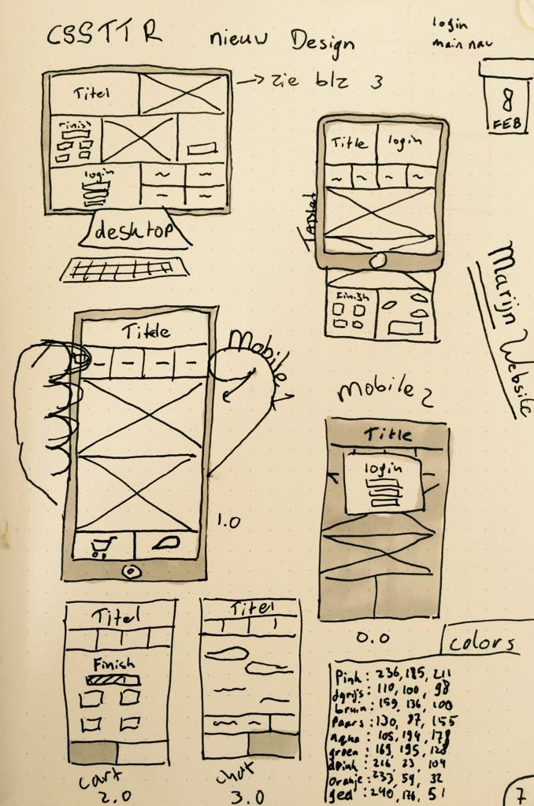

# Marijn's Website (week 1 en 2)

Voor deze opdracht van CSSTTR moeten wij een website maken die te gebruiken is door iemand met spasme. Aangezien deze persoon liever geen muis gebruikt, moet hij door de website heen kunnen '**Tab**ben'. Ook moeten wij gebruik maken van CSS Grids en mogen wij geen JavaScript gebruiken.

# Stijl
### Blokken
Ik heb een blokken-design gemaakt. Hier heb ik voor gekozen omdat alles dan in een oogopslag te zien is waar het staat. En er een logisch tab-pad inkomt. 

### Research
Om CSS Grids beter te leren begrijpen heb ik [deze video](https://www.youtube.com/watch?v=HgwCeNVPlo0) gekeken en aantekeningen gemaakt. Ook heb ik [CSS Grid Garden](http://cssgridgarden.com/#nl) gespeeld tot level 27. Verder heb ik gebruik gemaakt van de pseudo-class ":target". Deze had ik nooit eerder gebruikt.

# Progressie
### Wat gaat goed?
Werken met CSS vind ik moeilijk. Ik ken gelukkig de nodige trucjes om alles te centreren. Met grids werken gaan na de research die ik ernaar gedaan heb vrij goed. Ik heb zelfs een grid in een grid.... Grid-ception?
Ook ben ik blij dat ik gestopt ben met "clueless programmeren". In het begin ging ik namelijk alles tegelijkertijd stijlen, waardoor uiteindelijk niets goed uitzag. Nu heb ik een design waar ik wel blij mee ben en hopelijk mooie animaties en paden voor kan maken.

### Wat kan beter?
**In de klas**

Ik merk dat ik soms moeite heb om me te concentreren. Dat komt omdat ik nog niet helemaal thuis ben in CSS, dus er ook minder zin in heb. Gelukkig gaat dit sinds m'n nieuwe design beter, aangezien ik nu weet wat ik ga maken. Ook ben ik veel tijd kwijtgeraakt om uit te vogelen wat de logica en de verhouding was tussen de content. 

**In CSS**

  * Van animaties heb ik weinig kennis, dus kost het veel tijd. Gelukkig weet ik precies hoe ik wat wil animeren.
  * Ik vind het moeilijk om goede kleuren te vinden om in m'n design te zetten
  * Sinds het skelet van het design staat weet ik niet zeker of ik dit design nog wil.
  
# Eindproduct
  De website werkt. Je kan er goed doorheen met tab en sommige elementen worden groter als je erin Tabt. De vormgeving is helaas niet zo geworden als ik hoopte. Daarom heb ik eind week 2 een redesign gemaakt, maar ik had te weinig tijd om dit werkend te maken. Daarom ben ik verder gaan bouwen aan een "Slecht" design.
  
 **Proces** 
 In de laatste weken ging het werken goed. Helaas was ik dinsdag afwezig wegens ziekte. Ik ben begonnen met een design. Dit leek op papier een mooi design. Toen ik hem af had, was ik niet tevreden, dus heb ik een nieuwe tekening gemaakt op het zelfde design met meer detail. Dit heb ik toegepast. Toen alles af was, ben ik gaan kijken naar de kleuren die ik wilde gebruiken. Ik heb zeker 8 verschillende kleurenpaletten gemaakt en toegepast, maar er was er niet een die "goed uit de verf" kwam. Uiteindelijk heb ik voor de minst lelijke gekozen.
 
 **Tijdindeling**
 De meeste tijd ben ik kwijt geraakt aan het piekeren over waarom die onlogische elementen in de site moesten en tekenen. Ik was vaak aan het her-designen. Dit heeft veel tijd gekost
 
 **Eindresultaat**
 Ik ben al met al niet tevreden met het eindresultaat, omdat de vormgeving niet mooi is. Waar ik wel blij mee ben, is dat ik veel heb geleerd over css selectoren en animatie. De tabroute werkt goed. Zelf vind ik het ondanks dat een onvoldoende.
  
 > Emiel Muis
